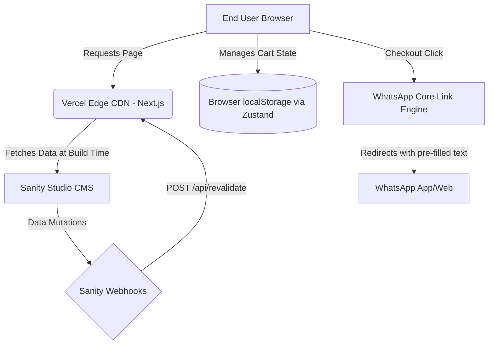

# Simple E-Commerce Architecture

## 1. High-Level System Design

The application utilizes a Serverless Jamstack architecture designed for zero maintenance and extremely high performance.

## 2. 🛑 ARCHITECTURAL CONSTRAINTS

> 🛑 ARCHITECTURAL CONSTRAINTS
> - **Zero Fixed Backend:** No traditional backend databases (e.g., PostgreSQL, MongoDB) or active API runtimes (e.g., Express, NestJS) are permitted.
> - **Checkout Delegation:** All checkout processing must be delegated to WhatsApp. The application must not handle payments, shipping calculations, or user authentication directly.
> - **Performance Priority:** Pages must be statically generated (SSG). Client-side fetching should only be used for interactivity that cannot be resolved at build time.

## 3. Application Structure & Data Fetching (SSG)

### Route Groups & Layouts
The application uses Next.js Route Groups to isolate the embedded CMS from the main storefront:
- **`app/(storefront)/`**: Contains the main e-commerce UI (`page.tsx`, `product/[id]/page.tsx`). It has its own `layout.tsx` that includes the Navbar and Footer.
- **`app/studio/`**: Contains the Sanity Studio. It utilizes the minimal root layout to ensure the CMS has a clean, full-viewport canvas without inheriting the storefront's Navbar or Footer.

### Data Fetching
Data fetching for the product catalog and banners occurs explicitly at build time using **Static Site Generation (SSG)**.

- **Fetching Location:** Server Components (`app/(storefront)/page.tsx` and `app/(storefront)/product/[id]/page.tsx`).
- **Mechanism:** `next-sanity` client fetches data using GROQ queries.
- **Cache Invalidation:** The Next.js layout cache is invalidated on-demand via the `/api/revalidate` webhook triggered by Sanity CMS when content is published.

## 4. WhatsApp Message Compilation Engine

The checkout engine is a purely functional utility that transforms the client-side cart state into a secure WhatsApp URL.

### Process Flow
1. User initiates checkout from the `CartSidebar` component.
2. The system retrieves the current `CartState` (array of `CartItem` objects).
3. The `generateWhatsAppLink(items, phoneNumber, currencySymbol)` utility executes:
   - Iterates through the cart items to calculate line totals.
   - Computes the grand total.
   - Formats a human-readable text string summarizing the order.
   - Encodes the string using `encodeURIComponent`.
4. The user is redirected to `https://wa.me/{phoneNumber}?text={encodedString}`.
